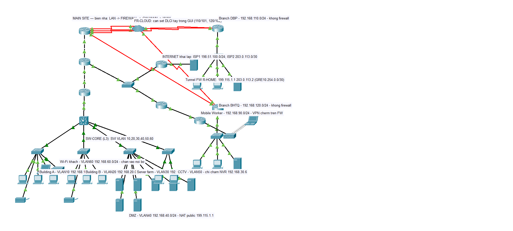

# BÁO CÁO TỐT NGHIỆP MÔN HỌC

**Môn học:** Mạng máy tính – Assignment 2
**Đề tài:** Thiết kế & Mô phỏng mạng cho Bệnh viện lớn – hạng mục quan trọng (Critical Large Hospital)
**Trường:** Đại học Bách Khoa TP.HCM (HCMUT)
**Phiên bản báo cáo:** v1.0 — ngày 21/10/2026

> **Quy ước trình bày:** Kiến trúc *thiết kế thực tế* được trình bày đầy đủ ở Step 1–3. Mô hình Packet Tracer (Step 4–7) là **bản thu nhỏ đại diện** của kiến trúc đó để kiểm chứng logic mạng. Toàn bộ kết quả đo trên mô hình đã được điền vào `Kết quả thực tế` ở bảng Step 5 và được chứng minh nguyên văn bằng transcription tại `docs/ptbuild/CCC-Hospital-v2/evidence-2026-11-11.md` (topology: `images/topology-v2.png`).

---

## MỤC LỤC

1. [Mục tiêu & phạm vi — ánh xạ user story](#1-mục-tiêu--phạm-vi--ánh-xạ-user-story)
2. [STEP 1 — Phân tích yêu cầu & khảo sát mặt bằng](#2-step-1--phân-tích-yêu-cầu--khảo-sát-mặt-bằng)
3. [STEP 2 — Thiết kế vật lý, danh mục thiết bị & sơ đồ WAN](#3-step-2--thiết-kế-vật-lý-danh-mục-thiết-bị--sơ-đồ-wan)
4. [STEP 3 — Tính toán băng thông chi tiết](#4-step-3--tính-toán-băng-thông-chi-tiết)
5. [STEP 4 — Dựng mô hình Packet Tracer](#5-step-4--dựng-mô-hình-packet-tracer)
6. [STEP 5 — Kiểm chứng kết nối](#6-step-5--kiểm-chứng-kết-nối)
7. [STEP 6 — Đánh giá reliability / upgrade / safe / security & định hướng](#7-step-6--đánh-giá-reliability--upgrade--safe--security--định-hướng-phát-triển)
8. [STEP 7 — Đóng gói & nộp bài trên BKeL](#8-step-7--đóng-gói--nộp-bài-trên-bkel)
9. [Phụ lục](#9-phụ-lục)

---

## 1. MỤC TIÊU & PHẠM VI — ÁNH XẠ USER STORY

### 1.1 Mục tiêu

Thiết kế mạng hoàn chỉnh cho một bệnh viện lớn hạng mục _critical_ gồm:

- **Main Site (TP.HCM):** 2 tòa nhà A/B (5 tầng, 10 phòng/tầng), Data Center (DC) và IT/Central Cabling Local cách nhau 50 m. **600 workstation**, **10 server**, ~12 thiết bị mạng + thiết bị bảo mật, Wi-Fi phủ toàn site, VLAN theo phòng ban, hạ tầng GPON + fiber + 1GbE/10GbE/40GbE.
- **2 trạm phụ:** DBP Street và BHTQ Street — tòa 2 tầng, mỗi trạm **260 workstation**, **2 server**, **≥5 thiết bị mạng** mỗi trạm.
- **WAN:** 2 đường leased line (chọn **MPLS, handoff Ethernet EPL**) Main↔DBP và Main↔BHTQ, cộng **đường serial dự phòng**; kết cấu sẵn sàng cho **SD-WAN overlay**; định tuyến **OSPF** (single area 0 trong mô phỏng).
- **Internet:** 2× DSL (ISP1 + ISP2) về R-EDGE-MS với cơ chế **load-share/failover** (mặc định đi ISP1, ISP2 floating AD 50); toàn bộ traffic Internet đi qua Main Site.
- **DMZ:** VLAN 40 phía sau firewall FW-MAIN (trong mô phỏng); thực tế đề xuất NGFW (Fortinet/Palo Alto/Cisco ASA FirePOWER).
- **Bảo mật:** ACL cô lập WiFi khách, NAT/PAT + static NAT cho DMZ, hardening thiết bị, port-security, syslog + NetFlow làm nền tảng IDS/IPS.

### 1.2 Ánh xạ user story từ đề bài

| #    | User story (rút gọn từ đề)                                                               | Yêu cầu kỹ thuật đáp ứng                                  | Mục kiểm tra (Step 5) |
| ---- | ---------------------------------------------------------------------------------------- | --------------------------------------------------------- | --------------------- |
| US-1 | Là nhân viên y tế tại tòa A/B/các trạm phụ, tôi cần truy cập HIS/PACS/DNS nội bộ ổn định | VLAN theo phòng ban, Router-on-a-stick + OSPF, DNS nội bộ | KC-1, KC-2            |
| US-2 | Là bệnh viện, tôi cần 2 đường leased line dẫn về Main Site, đứt 1 vẫn chạy               | MPLS EPL ×2 + serial backup + floating static/OSPF metric | KC-2                  |
| US-3 | Tôi cần Internet cho toàn viện, đứt ISP nào cũng phục vụ được                            | 2× DSL về R-EDGE-MS, NAT/PAT, floating route AD 50        | KC-3                  |
| US-4 | Khách dùng Wi-Fi trả phí phải bị cô lập với mạng nội bộ                                  | ACL VLAN 60/63/73: chỉ DNS nội bộ + web DMZ + Internet    | KC-4                  |
| US-5 | Website/email của bệnh viện phải truy cập được từ Internet                               | DMZ VLAN 40 + static NAT share IP public `199.115.1.1:80/443 → 10.0.1.2`, `:25 → 10.0.1.3` | KC-5                  |
| US-6 | Tôi cần quản trị thiết bị an toàn (SSH, secret, log)                                     | Hardening, ACL MGMT, syslog + NetFlow về SRV-LOG          | KC-6                  |
| US-7 | Camera/IP camera phải nằm riêng khỏi mạng truy cập                                       | VLAN 50 CCTV riêng, NVR giám sát                          | KC-1                  |
| US-8 | Teleworker/BSI trực cần VPN về mạng nội bộ                                               | Site-to-site IPsec + client VPN (teleworker)              | Phụ lục A             |

---

## 2. STEP 1 — PHÂN TÍCH YÊU CẦU & KHẢO SÁT MẶT BẰNG

### 2.1 Tổng hợp yêu cầu

| Nhóm          | Yêu cầu                                                                   | Ghi chú thiết kế                                                                       |
| ------------- | ------------------------------------------------------------------------- | -------------------------------------------------------------------------------------- |
| Quy mô        | 600 + 260 + 260 = **1120 workstation**; server 10 + 2 + 2 = **14 server** | PC trạm phụ phụ thuộc server trung tâm (HIS/PACS đặt Main)                             |
| Cấu trúc      | VLAN theo phòng ban; guest Wi-Fi tách biệt                                | Bảng VLAN chi tiết ở §2.2                                                              |
| Hạ tầng       | GPON (toà A/B), fiber backbone, 1GbE access / 10GbE core / 40GbE DC       | Thẩm định đường ống khi khảo sát                                                       |
| WAN           | 2× MPLS EPL + serial backup; sẵn sàng SD-WAN                              | OSI multi-area thực tế, single-area 0 trong PT                                         |
| Internet      | 2× DSL load-share/failover, tổng thông qua Main                           | PBR/floating static trong mô phỏng                                                     |
| DMZ           | Web + Mail cho bên ngoài                                                  | Static NAT 1:1                                                                         |
| Bảo mật       | ACL, NAT, hardening, port-security, syslog/NetFlow                        | Cẩm nang ở Phụ lục B                                                                   |
| Ứng dụng y tế | HIS, RIS-PACS, LIS, CRM, DB, CCTV/NVR, DNS, syslog                        | Load balancer đặt trước HIS/RIS-PACS/DB (§2.4); LIS/CRM chạy chung server farm VLAN 20 |

### 2.2 Cấu trúc VLAN / địa chỉ IP (đã chốt — v3 dải 10.x, 2026-11-11)

**Main Site — VLAN 10–60 (gateway mỗi VLAN = `.1`, đặt trên SVI SW-CORE trong mô hình):**

| VLAN | Tên         | Địa chỉ        | Công dụng            |
| ---- | ----------- | -------------- | -------------------- |
| 10   | DEPT-A      | 10.0.64.0/19   | Tòa A                |
| 20   | DEPT-B      | 10.0.96.0/19   | Tòa B                |
| 30   | SERVER-FARM | 10.0.16.0/20   | DNS/HIS/PACS/LOG/NVR |
| 40   | DMZ         | 10.0.1.0/24    | WEB/MAIL công khai   |
| 50   | CCTV        | 10.0.32.0/19   | Camera IP            |
| 60   | WIFI-GUEST  | 10.0.8.0/21    | Khách trả phí        |

> Thiết kế thật bổ sung thêm **VLAN MGMT riêng** (dải quản trị không có gateway ra Internet);
> mô hình Packet Tracer quản trị thiết bị qua console/SSH nên không dựng VLAN MGMT.

**Trạm phụ DBP Street:** LAN `10.128.0.0/14` — GW `10.128.0.1` (GW-DBP); staff + server
SRV-DBP-1 `.10` (thiết kế thật tách VLAN 61 staff / 62 server / 63 guest trong dải này).
**Trạm phụ BHTQ Street:** LAN `10.132.0.0/14` — GW `10.132.0.1` (GW-BHTQ); staff + server
SRV-BHTQ-1 `.10` (thiết kế thật tách VLAN 71/72/73).
**Mobile worker (LAN nhà teleworker):** `10.127.128.0/24` — GW `10.127.128.1` (R-HOME),
về Main qua tunnel FW-MAIN ↔ R-HOME.

**WAN (mô hình PT — mô phỏng L2 leased line):** PVC Frame Relay `172.17.10.0/30` (Main—DBP)
+ `172.17.20.0/30` (Main—BHTQ) — static AD 100; serial backup `172.18.10.0/30` +
`172.18.20.0/30` — floating AD 200. Ngày thực tế các đường này là **MPLS handoff Ethernet
(EPL) 300 Mbps/trạm**; Frame Relay chỉ là cách cấp L2 leased line trong PT.

**Internet mô phỏng:** FW-MAIN nối 2 ISP tại `199.115.1.0/29` (FW `.1`, ISP1 `.2`, ISP2 `.3`);
dải "Internet" `198.51.100.0/24` (SRV-INT `.10`) neo sau ISP1; WAN R-HOME `203.0.113.0/30`
sau ISP2; GRE overlay FW↔R-HOME `10.254.0.0/30`. DMZ static NAT **share IP public**
`199.115.1.1:80/443 → 10.0.1.2`, `:25 → 10.0.1.3`.

### 2.3 Checklist khảo sát mặt bằng (site survey — 15 hạng mục)

| #   | Hạng mục kiểm tra                                                                | Mục đích / tiêu chí                                                                                        |
| --- | -------------------------------------------------------------------------------- | ---------------------------------------------------------------------------------------------------------- |
| 1   | Vị trí tủ rack (mỗi tường tầng, phòng DC, IT Central Cabling)                    | Sát tường, có nền gạch/nâng, chiều sâu ≥600 mm, có mặt bằng treo/đặt                                       |
| 2   | Đường ống cáp sẵn có (trunk + riser)                                             | Đo cỡ ống, tỷ lệ phối đầy ≤40%, dẫn ngang các tầng                                                         |
| 3   | Chiều dài nhánh cáp thực tế                                                      | Trong nhà về tủ ≤90 m; **khoảng cách >90 m trong nhà → bắt buộc fiber**                                    |
| 4   | Chiếu sáng phòng kỹ thuật/tủ rack ≥ 300 lx                                       | Thiếu sáng → bổ sung đèn LED dự phòng nguồn UPS                                                            |
| 5   | Hệ thống chống sét, tiếp đất                                                     | Điện trở đất ≤4 Ω, SPD loại 1/2 ở bảng điện, thanh tiếp đất riêng cho rack                                 |
| 6   | Nguồn điện: số pha, công suất dự kiến cho rack                                   | Rack tối thiểu 2 nhánh 16A/220V, có ATS + UPS (10–15 phút động cơ máy phát)                                |
| 7   | Nhiệt độ/hút ẩm phòng DC & IT Cabling                                            | 18–27 °C, RH 40–60%, dự tính tải nhiệt (BTU) khi đặt điều hòa                                              |
| 8   | Khoảng cách giữa các tòa (A↔B, DC↔IT Cabling = 50 m)                             | 50 m chạy multimode OM4 fiber, cắt bằng 10GbE/40GbE                                                        |
| 9   | Kiểm kê hạ tầng thiết bị tồn (switch/router/AP/UPS cũ)                           | Có thể tái sử dụng, hoặc phải decommission — liệt kê serial, đến hạn bảo hành                              |
| 10  | Quyền chôn cáp khu vực chung (hành lang ngoài, đường dẫn giữa các tòa, trạm phụ) | Xin phép quản lý tòa nhà, có hồ sơ trình duyệt đấu nối ngầm                                                |
| 11  | Trải nghiệm Wi-Fi hiện tại & kế hoạch dịch vụ Wi-Fi trả phí khách                | Số lượng AP hiện hữu, điểm "dead zone", chọn SSID/WPA2 + VLAN guest, phương thức tính phí (voucher/portal) |
| 12  | Hệ thống camera an ninh/giám sát hiện hữu                                        | Kiểm kê số đầu camera analog/IP, kế hoạch chuyển IP, vị trí NVR, băng thông upstream                       |
| 13  | Phòng server & phòng tủ phân phối điện DC                                        | Hệ thống điều hòa dự phòng, khí FM200/Novec, cửa thoát, phụ tải                                            |
| 14  | Kết nối ISP sẵn có (gói GPON nhà cung cấp, điểm đấu cáp quang vào nhà)           | Xác định điểm thắng quang (MDF/ODF), số lõi dự phòng ≥20%                                                  |
| 15  | Điểm đặt router WAN & tủ đầu cuối trạm phụ DBP/BHTQ                              | Vị trí đấu leased line, điều kiện làm việc của kỹ thuật viên nhà mạng                                      |

### 2.4 Xác định vùng tải cao (hotspots)

- **Server Farm / DMZ:** mọi truy vấn HIS/PACS từ 1120 workstation dồn về VLAN 20; DMZ chịu traffic Internet. ⮑ **10GbE/40GbE** từ DC lên core, uplink SC riêng.
- **Khe giờ truy cập DB cao:** **9h–11h sáng và 15h–16h chiều** (tổng **3 giờ hiệu dụng/ngày**), ~80% dịch chuyển dữ liệu tập trung trong khung này, 5 ngày/tuần (dùng làm cơ sở tính Step 3).
- **Load balancer đặt ngay trước HIS / RIS-PACS / DB cluster:** phân tải L4/L7, health-check, failover giữa cụm server, tránh tình trạng "một server nghẽn, cả bệnh viện dừng".

### 2.5 Kết cấu kiến trúc — sơ đồ phân tầng

Chọn cấu trúc kiểu phân tầng **Access – Distribution – Core – Data Center + WAN**: modul hoá theo tầng/tòa, dễ mở rộng, định tuyến ở lõi, ổn định domain failure nhỏ.

``                    ┌─────────────────────────── INTERNET (2× DSL) ──────────────────────────┐
                    │                                        │                                │
                    │   ISP1 ───────────►┌──────────┐◄─────── ISP2                        │
                    │                   │ R-EDGE-MS │  (firewall + NAT + DMZ)              │
                    │                   └────┬─────┘        │                             │
                    │                  DMZ VLAN 40 (SW-DMZ)   │                              │
                    │                  SRV-WEB / SRV-MAIL    │                              │
                    │                                       │                               │
   WAN (2×MPLS+serial) ─── R-WAN-MS ───┐        ┌────── R-CORE-MS (router-on-a-stick ◄──┘
                                        │        │        inter-VLAN, OSPF area 0)
                                   10GbE │        │
                    ┌────────────────────┴────────┴───────────┐
                    │              SW-CORE (L3)               │
                    └──┬──────────┬──────────┬──────────────┬─┘
                       │          │          │              │
                 SW-BLD-A   SW-BLD-B   SW-SRV(VLAN20/200)  SW-CCTV(VLAN50)
                 VLAN30     VLAN40      SERVER-FARM         CCTV
                 AP-A,PC    AP-B,PC     DMZ/SRV, LB         NVR/CAM
                       +      +
                  AP Tòa A  AP Tòa B  (+ VLAN60 WiFi khách)

   ══════ Trạm phụ DBP Street / BHTQ Street (nhân bản) ══════
        R-DBP  ── eth(EPL) ──► R-WAN-MS (Main)          [serial backup ↓]
          │  VLAN61 staff / VLAN62 server / VLAN63 guest (router-on-a-stick)
          └─ SW-DBP access ── 260 PC + 2 SRV + AP + guests

   ══════ Home / Teleworker ══════
        Laptop (+AP-HOME/SW-HOME) ──Internet──► R-EDGE-MS / NGFW (client VPN)
``
### 2.6 Thẩm mỹ (aesthetics) & tiêu chuẩn lắp đặt

- Cáp đi trong **cống/kênh cáp kín (coro/thanh treo)** đạt chuẩn **TIA-568A/B (TIA-568-D)**: tách cáp điện/cáp tín hiệu ≥ 30 cm (song song) hoặc bắt buộc cách bằng vách kim loại đã tiếp đất.
- **Patch panel mỗi tầng** (copper Cat6A + fiber ODF tại tủ IT Cabling), ghi nhãn theo chuẩn TIA-606.
- Rack 42U đặt gọn, quản lý cáp đạt chuẩn (PDU dọc, velcro thay zip-tie), tủ khép, có cửa thoát khí trước mặt.
- Cấp dây: Cat6A cho access (hỗ 10GBase-T ngắn), fiber OM4 giữa các tòa/DC, single-mode về nhà mạng GPON.

---

## 3. STEP 2 — THIẾT KẾ VẬT LÝ, DANH MỤC THIẾT BỊ & SƠ ĐỒ WAN

### 3.1 Bảng danh mục thiết bị đề xuất (thiết kế thực tế)

> **Giá tham chiếu 2025–2026 (triệu VND, chưa VAT), sai số ±15%.** Số lượng ước tính cho quy mô 1120 workstation + 14 server.

| STT | Thiết bị                   | Model đề xuất                    | SL             | Đơn giá (triệu)     | Thành tiền (triệu) | Vai trò                                                 |
| --- | -------------------------- | -------------------------------- | -------------- | ------------------- | ------------------ | ------------------------------------------------------- |
| 1   | Access switch PoE+ 48-port | Catalyst 9200L-48P-4G            | 30             | 105                 | 3 150              | Access tòa A/B/trạm phụ (AP+camera+PC)                  |
| 2   | Distribution/DC switch 48p | Catalyst 9300-48P                | 6              | 180                 | 1 080              | Tập trung từng tầng/khối; stackwise                     |
| 3   | Core switch L3             | Catalyst 9500-16X (10G)          | 2              | 420                 | 840                | Core HA 2× (pair)                                       |
| 4   | Router WAN Main            | ISR 4451-X                       | 1              | 250                 | 250                | R-WAN-MS: 2× MPLS EPL + NIM serial                      |
| 5   | Router WAN trạm phụ        | ISR 4331                         | 2              | 90                  | 180                | R-DBP/R-BHTQ + NIM-2T serial                            |
| 6   | NGFW Main (HA pair)        | FortiGate 600E                   | 2              | 320                 | 640                | R-EDGE-MS: NAT/PAT, DMZ, IPS/SSL-DPI, VPN               |
| 7   | AP Wi-Fi 6 indoor          | Catalyst 9130AXI                 | 28             | 28                  | 784                | Phủ 2 tòa (10 tầng × 2 AP) + DC + 2 trạm                |
| 8   | WLC                        | Catalyst 9800-40 (HA SSO)        | 1              | 380                 | 380                | Quản lý tập trung AP, VLAN guest                        |
| 9   | GPON OLT + ONU             | OLT 8-port + ONU                 | 1 + 32         | 90 / 1.8            | 148                | Hạ tầng GPON trong toà + trạm                           |
| 10  | Server rack 2U             | HPE ProLiant DL380 Gen11         | 14             | 190                 | 2 660              | DNS/HIS/PACS×2/DB×2/LOG/NVR/MAIL-DMZ/WEB-DMZ/branch SRV |
| 11  | Storage SAN/NAS            | HPE MSA 2052 / NAS + backup NAS  | 2              | 300                 | 600                | Lưu HIS/PACS (đề xuất 10–20 TB thiết kế)                |
| 12  | Load balancer              | F5 BIG-IP VE / HAProxy + VE      | 1 cụm (2 node) | 180                 | 180                | Đặt trước HIS/RIS-PACS/DB                               |
| 13  | Patch panel copper/fiber   | Cat6A 24p ×40, ODF ×12           | 52             | 4                   | 208                | TIA-568, mỗi tầng                                       |
| 14  | UPS 10 kVA + ATS           | APC/UGreen rack                  | 6              | 130                 | 780                | Rack DC, IT Cabling, trạm phụ                           |
| 15  | UPS rack 3 kVA             | —                                | 20             | 30                  | 600                | Tủ tầng                                                 |
| 16  | Rack 42U / 9U              | —                                | 8 / 12         | 40 / 12             | 464                | DC + IT Cabling + tầng                                  |
| 17  | Cáp & vật tư               | OM4/SM + Cat6A + coro + phụ kiện | lô             | —                   | 1 200              | Ước ~25 km cáp, 10% dự phòng lõi quang                  |
| 18  | Software/licence           | IOS-XE, FortiCare, WLC licence   | gói            | —                   | 500                | Hỗ trợ 3–5 năm                                          |
|     |                            |                                  |                | **Tổng (ước tính)** | **≈ 14 600**       | ≈ 14,6 tỷ VND                                           |

### 3.2 Thiết bị mô phỏng Packet Tracer (bản thu nhỏ, khớp kiến trúc)

FW-MAIN = Cisco **2911** (firewall/NAT/DMZ + đầu cuối VPN), R-CORE-MS = Cisco **2911** (inter-VLAN, DHCP tập trung, router-on-a-stick _thay cho 2× L3 switch_), GW-MAIN = Cisco **ISR4331** (WAN hub), GW-DBP/GW-BHTQ = Cisco **2911**, R-HOME = Cisco **2911** (teleworker), ISP1/ISP2 = Cisco **2911**, SW-CORE = **3560-24PS**, switch truy cập = **2960-24TT**; wireless = AccessPoint-PT (AP-GUEST, AP-HOME). **Tổng 49 thiết bị, 49 link** — địa chỉ & WAN chi tiết ở §5.4.

### 3.3 Sơ đồ vật lý Main Site (mô tả)

``                         ┌────────────────────────── Main Site TP.HCM ────────────────────────────┐
                         │                                                                        │
   Toà A (5 tầng)        │      Toà B (5 tầng)               Data Center          IT/Central Cabling
 ┌───────────────────┐   │  ┌───────────────────┐        ┌────────────────┐      ┌──────────────────┐
 │ F5: AP-A5, PP-A5  │   │  │ F5: AP-B5, PP-A5  │        │ 2×C9500 core    │◄─50m─┤ ODF, rack patch, │
 │ ...               │◄50m─►│ ...               │◄──────►│ DC: 9300, SRV×10│      │ GPON OLT, WLC    │
 │ F1: AP-A1, PP-A1  │   │  │ F1: AP-B1, PP-B1  │        │ NGFW pair, R-EDGE│      │ R-WAN-MS, R-CORE │
 └─────────┬─────────┘   │  └─────────┬─────────┘        └───────┬────────┘      └────────┬─────────┘
           │ OM4 fiber   │            │ OM4 fiber                │ SW-DMZ (VLAN 40 DMZ)        │
           └─────────────┴────────────┴──────► SW-CORE (SW layer)◄──┴─────────────────────────┘
                                                  │
                          VLAN: 10 Toà A │ 20 Toà B │ 30 SRV │ 40 DMZ │ 50 CCTV │ 60 WiFi-Guest (+ VLAN MGMT riêng)
``
Mỗi tòa 5 tầng × 10 phòng; mỗi tầng: patch panel + 1 access switch 48p (hoặc 2 nếu >24 socket/tầng), 2 AP Wi-Fi 6; backhaul fiber OM4 về SW-CORE/IT Central Cabling.

### 3.4 Sơ đồ trạm phụ (nhân bản 2 site)

``┌──── Trạm phụ (DBP / BHTQ) — 2 tầng ────┐
│  R-DBP (ISR4331)                        │
│   ├─ WAN chính (ngày thật: EPL handoff; │
│   │   mô hình PT: PVC Frame Relay):     │
│   │    ├─ S0/x/0: 172.17.10.2/30 (DBP)  │
│   │    ├─ S0/x/0: 172.17.20.2/30 (BHTQ) │
│   └─ NIM-2T Serial backup:              │
│        172.18.10.2/30 ↔ R-WAN-MS (DBP)  │
│        172.18.20.2/30 ↔ R-WAN-MS (BHTQ) │
│  SW-DBP 2960: LAN 10.128.0.0/14 (DBP)   │
│    hoặc 10.132.0.0/14 (BHTQ) — staff /  │
│    SRV / guest tách VLAN                │
│  260 PC + 2 SRV + AP                    │
└─────────────────────────────────────────┘
``
### 3.5 Sơ đồ WAN & OSPF

``                 ┌─ EPL handoff 172.17.10.0/30 ── R-DBP (.2)
R-WAN-MS (.1/.1) ┤   (mô hình PT: PVC Frame Relay DLCI 110↔101)
(Main)  ─ serial backup 172.18.10.0/30 ─→ R-DBP (.2)
                 │
                 ├─ EPL handoff 172.17.20.0/30 ── R-BHTQ (.2)
                 └─ serial backup 172.18.20.0/30 ─→ R-BHTQ (.2)
                     (mô hình PT: DLCI 120↔102)

OSPF:  area 0 backbone (Main),  area 1 (DBP),  area 2 (BHTQ)
       [mô phỏng PT: single area 0]
Serial backup: OSPF cost cao (bandwidth thấp) → EPL đứt thì OSPF tự chuyển sang serial làm primary;
kết quả SD-WAN overlay chuẩn bị sẵn: GRE/IPsec + BFD trên đường IPsec.
``
**Định tuyến:** OSPF tại Main; static route floating AD 50 cho WAN nếu cần chắc chắn failover; nội bộ DMZ default về R-CORE-MS, Internet default về R-EDGE-MS.

**Định tuyến Internet:** NAT/PAT trên R-EDGE-MS; static default `0.0.0.0/0 → ISP1` + floating AD 50 `→ ISP2` (failover); (muốn load-share thật dùng PBR/ECMP/BGP — ghi trong SD-WAN roadmap).

### 3.6 So sánh phương án WAN — danh sách các lựa chọn khả thi, chi phí & ưu/nhược

> Đề bài yêu cầu _liệt kê hết các phương án khả thi, gợi ý chi phí và phân tích ưu/nhược điểm của
> phương án chọn_. Giá thuê dưới đây là **ước tính thị trường VNPT/Viettel/FPT 2026**, cần chốt lại
> bằng báo giá thực tế từng nhà mạng trước khi ký.

| #   | Phương án                                | Công nghệ                            | Chi phí thuê (ước tính/tháng/trạm phụ)                | Ưu điểm                                                                                        | Nhược điểm                                                                     | Kết luận                                                         |
| --- | ---------------------------------------- | ------------------------------------ | ----------------------------------------------------- | ---------------------------------------------------------------------------------------------- | ------------------------------------------------------------------------------ | ---------------------------------------------------------------- |
| 1   | MPLS L3VPN ISP                           | VRF + BGP với CE                     | 15–25 triệu (CIR 300 Mbps, SLA 99,9%)                 | SLA + QoS theo lớp, tách routing nội bộ khỏi ISP                                               | Phụ thuộc nhà mạng, chi phí cao theo site, ISP quản lý routing                 | Tốt cho >5 site — không cần thiết với 2 trạm phụ                 |
| 2   | **MPLS handoff Ethernet (EPL/EVPL)**     | L2 leased point-to-point transparent | **10–15 triệu** (CIR 300 Mbps)                        | Kênh L2 trong suốt, OSPF do ta chủ động, băng thông đảm bảo CIR, nâng cấp dễ 1G/10G            | Chỉ point-to-point (hub-spoke), mức SLA theo hợp đồng                          | ✅ **CHỌN** (cả 2 trạm phụ, + serial backup)                     |
| 3   | Leased line serial truyền thống (FR/PPP) | Serial FR/PPP DCE-DTE                | 5–8 triệu (2–8 Mbps)                                  | Rẻ, ổn định, sẵn trong thư viện PT (mô hình dùng làm L2 leased-line backup)                    | Băng thông thấp, công nghệ lỗi thời — chỉ đủ cho lưu lượng trọng yếu tối thiểu | Chọn làm backup; trong .pkt chỉ là mô phỏng L2                   |
| 4   | IPsec/DMVPN over Internet                | SVTI/GRE trên 2 ISP hiện hữu         | ~1–2 triệu (phần băng thông ISP tăng lệch)            | Rẻ nhất, cấu hình tự chủ, sẵn site-to-site IPsec (Phụ lục A)                                   | Không SLA, độ trễ/rớt gói phụ thuộc Internet chất lượng                        | Phương án backup thứ cấp                                         |
| 5   | SD-WAN (Cisco SD-WAN / FortiGate ADVPN)  | Overlay IPsec trên Internet + 4G/5G  | CPE 20–40 triệu/site + subscription ~5–10 triệu/tháng | App-aware routing (ưu tiên HIS/PACS), zero-touch, quan sát tập trung; transport dự phòng 4G/5G | CAPEX/OPEX ban đầu cao, cần nhân sự vận hành                                   | Roadmap 6–18 tháng (§7.3) — thiết kế tunnel GRE/SVTI đã sẵn sàng |

**Phương án chốt:** **EPL 300 Mbps ×2 (đường chính) + serial backup (dự phòng)** — tổng chi thuê
ước tính ~20–30 triệu/tháng cho lane liên trạm, cộng Internet 2×1 Gbps corporate (SLA, IP tĩnh)
~15–25 triệu/tháng.

### 3.7 Đề xuất hệ thống giám sát camera (CCTV)

**Phạm vi:** toàn khuôn viên Main Site (2 tòa + DC + IT/Cabling + ngoài trời) và 2 trạm phụ.
Camera IP đặt riêng VLAN 50, lấy PoE từ switch tầng, chỉ kết nối tới NVR (không có gateway ra
Internet) — khớp ma trận policy ở Phụ lục B.2 (NVR ↔ camera, deny mọi chiều khác).

| Khu vực                    | Vị trí lắp                                                   | Số camera                   | Loại đề xuất                    |
| -------------------------- | ------------------------------------------------------------ | --------------------------- | ------------------------------- |
| Tòa A + B (mỗi tòa 5 tầng) | Mỗi tầng: 1 hành lang + 1 lối thang bộ + 1 thang máy         | 3 × 5 tầng × 2 tòa = **30** | Dome IP 4 MP, IR cho hành lang  |
| Sảnh chính/reception       | Lối vào, quầy lễ tân, làn vào, sau phòng đợi                 | **4**                       | Dome 4 MP, chống ngược sáng     |
| Data Center + IT/Cabling   | DC: 4 (khu rack + cửa); IT Cabling: 2                        | **6**                       | Dome/Box IP 4 MP có mic         |
| Bãi xe + khuôn viên        | Cổng vào/ra, 4 góc bãi, viền tường                           | **8**                       | Bullet IP 4 MP, IR 30 m         |
| Trạm phụ DBP               | 2 tầng: 1 hành lang + 1 lối thang/tầng + sảnh + phòng server | **7**                       | Dome/Bullet 4 MP                |
| Trạm phụ BHTQ              | Nhân bản DBP                                                 | **7**                       | Dome/Bullet 4 MP                |
| **Tổng**                   |                                                              | **62 camera**               | IP PoE (IEEE 802.3af/at), H.265 |

**Thông số & hạ tầng:**

- Chất lượng: 4 MP @ H.265 ≈ **4 Mbps/camera**; tổng luồng khi chạy đồng loạt ≈
  62 × 4 ≈ **250 Mbps** — uplink switch CCTV (VLAN 50) về SW-CORE dùng 10G nên không ảnh hưởng
  VLAN nhân viên/ nghiệp vụ.
- NVR: Main Site **2× NVR 32 kênh (RAID-6)**, chia nửa camera theo tòa (failover); trạm phụ mỗi
  site **1× NVR 8 kênh (RAID-5)**, ghi 14 ngày local.
- Dung lượng ghi hình: 4 Mbps ≈ 42 GB/ngày/camera nếu ghi liên tục; dùng chế độ motion-detection
  (~40% thời gian có sự kiện) → Main ≈ (56 camera × 42 GB × 30 ngày × 40%) ≈ 28 TB; mỗi trạm phụ
  ≈ 3–4 TB. Backup footage theo quy 3-2-1 (Phụ lục B.12), còn lại theo chính sách lưu dữ y tế.
- Nguồn: switch CCTV tầng dùng PoE+ (30 W/port) + UPS chung rack tầng; camera ngoài trời có SPD
  chống sét trên cả nguồn và cáp tín hiệu.
- Riêng tư/pháp lý: biển báo khu vực có camera; quyền xem NVR phân quyền theo RBAC; VLAN 50
  không có đường ra Internet — chỉ NVR ↔ camera.

---

## 4. STEP 3 — TÍNH TOÁN BĂNG THÔNG CHI TIẾT

Chi tiết công thức, phương pháp đo Packet Tracer, bảng test và mẫu bằng chứng lưu tại [Phụ lục D — Đo lường và báo cáo băng thông](appendix/bandwidth-report.md).

### 4.1 Số liệu đề bài (giả định tổng hợp)

| Hạng mục                              | Giá trị                                                                       |
| ------------------------------------- | ----------------------------------------------------------------------------- |
| Workstation                           | 600 (Main) + 260 (DBP) + 260 (BHTQ) = **1120**                                |
| Lưu lượng/ workstation                | **500 MB tải xuống + 100 MB tải lên / ngày**                                  |
| Server (14: 10 Main + 2 DBP + 2 BHTQ) | **1000 MB xuống + 2000 MB lên / ngày mỗi server**                             |
| Wi-Fi guest                           | **500 MB tải xuống / ngày mỗi thiết bị khách**                                |
| Khe giờ cao điểm DB                   | **9–11h & 15–16h** (= **3 giờ hiệu dụng/ngày**), ~80% tải nằm trong khung này |
| Tuần làm việc                         | 5 ngày/tuần                                                                   |
| Hệ số tăng trưởng dự phòng            | **20% trong 5 năm**                                                           |

Giả định bổ sung (phải ghi rõ): số thiết bị Wi-Fi khách đồng thời/ngày ≈ **150–200 thiết bị** (100 tại Main, 25–50 mỗi trạm phụ) — lấy 200 để lấy biên trên an toàn (bảo thủ).

### 4.2 Bảng tổng dung lượng/ngày

| Nguồn tải                   | Số lượng | Tải xuống (MB/ngày) | Tải lên (MB/ngày)  |
| --------------------------- | -------- | ------------------- | ------------------ |
| Workstation Main            | 600      | 600 × 500 = 300 000 | 600 × 100 = 60 000 |
| Workstation DBP             | 260      | 130 000             | 26 000             |
| Workstation BHTQ            | 260      | 130 000             | 26 000             |
| Server (14)                 | 14       | 14 × 1000 = 14 000  | 14 × 2000 = 28 000 |
| Wi-Fi guest (≈200 thiết bị) | 200      | 200 × 500 = 100 000 | 0                  |
| **Tổng**                    |          | **674 000**         | **140 000**        |

**Tổng cả 2 chiều:** 674 000 + 140 000 = **814 000 MB/ngày** × 8 bit/byte = **6 512 000 Mbit/ngày (≈ 6,512 Tbit/ngày)**.

### 4.3 Phương pháp A — phân bổ đều trên thời gian hiệu dụng (bảo thủ)

Thời gian hiệu dụng = 9–11h + 15–16h = **3 h = 10 800 giây/ngày**.

``B_A = Tổng Mbit ÷ thời gian hiệu dụng
    = 6 512 000 Mbit ÷ 10 800 s
    ≈ 603 Mbps      (trung bình khung giờ hiệu dụng)
+ tăng trưởng 20%/5 năm → 603 × 1,2 ≈ 724 Mbps
``
→ Với phương pháp phân bổ đều, cần tối thiểu **≈ 724 Mbps tổng** băng thông Internet.

### 4.4 Phương pháp B — quy tắc 80/20 (80% tải trong 1/2 thời gian)

80% dung lượng nằm trong 5 400 s (1/2 thời gian hiệu dụng):

``B_peak = 0,8 × 6 512 000 ÷ 5 400 ≈ 965 Mbps   (tập trung khe 9–11h & 15–16h)
20% còn lại phân bổ trên 5 400 s:        ≈ 241 Mbps
``
→ Công suất phải đáp ứng **giờ peak ≈ 965 Mbps**, cộng tăng trưởng 20%/5 năm:

``965 × 1,2 ≈ 1 158 Mbps
``
### 4.5 Kết luận & lựa chọn gói

Tổng băng thông Internet khuyến nghị: **2× [500 Mbps – 1 Gbps]**.

| Phương án       | Gói                                               | Đánh giá                                                                                             |
| --------------- | ------------------------------------------------- | ---------------------------------------------------------------------------------------------------- |
| Tối thiểu       | 2× DSL/fiber 500 Mbps (ISP1 chính, ISP2 floating) | Đủ phương pháp A (724 Mbps < 1 Gbps tổng), thiếu dư địa cho peak 1 158 Mbps                          |
| **Khuyến nghị** | **2× fiber 1 Gbps (SD-WAN ready)**                | Đủ phương pháp B trọn vòng (peak 1 158 Mbps), có dư cho PACS hình ảnh, failover không mất chất lượng |
| Bổ trợ          | 2× MPLS EPL 300 Mbps (liên trạm) + serial backup  | Xem bên dưới                                                                                         |

### 4.6 Cỡ băng thông đường WAN theo trạm phụ

Tổng load qua WAN **mỗi trạm phụ** (thiết kế: toàn bộ Internet đi qua Main ⇒ mạng trạm phụ + khách Internet trạm đều đi qua):

``Down qua WAN = staff (260×500 = 130 000) + guest (50×500 = 25 000)
             + branch server tải xuống từ Internet (2×1000 = 2 000) = 157 000 MB
Up qua WAN   = staff (26 000) + server (2×2000 = 4 000)                =  30 000 MB
Tổng          = 187 000 MB/ngày = 1 496 000 Mbit/ngày

Phương pháp A: 1 496 000 ÷ 10 800 ≈ 139 Mbps  → ×1,2 ≈ 166 Mbps
Phương pháp B: 0,8 × 1 496 000 ÷ 5 400 ≈ 222 Mbps → ×1,2 ≈ 266 Mbps
``
→ **Chọn MPLS EPL 300 Mbps/hướng mỗi trạm phụ**, đường serial backup (N×E1 hoặc IPsec broadband) chạy OSPF cost cao; khi leased-line đứt, serial đủ cho HIS/PACS/dịch vụ trọng yếu.

### 4.7 Bảng gợi ý gói ISP (đã chốt)

| Kênh             | Loại                   | Băng thông       | Mục đích                               |
| ---------------- | ---------------------- | ---------------- | -------------------------------------- |
| ISP1 Main        | Fiber corporate        | 1 Gbps (min 500) | Internet chính, DMZ static NAT         |
| ISP2 Main        | Fiber corporate        | 1 Gbps (min 500) | Failover (floating AD 50) + load-share |
| MPLS EPL #1      | Leased Ethernet        | 300 Mbps         | Main ↔ DBP                             |
| MPLS EPL #2      | Leased Ethernet        | 300 Mbps         | Main ↔ BHTQ                            |
| Serial backup ×2 | N×E1 / IPsec broadband | 2–8 Mbps         | OSPF cost cao, ưu tiên HIS/PACS        |

---

## 5. STEP 4 — DỰNG MÔ HÌNH PACKET TRACER

> Mô hình bản nộp: **`simulation/CCC-Hospital-v2.pkt`** — **49 thiết bị / 49 link**, dựng bằng MCP
> PTBuilder trên Packet Tracer 9.0.1. Toàn bộ kết quả đo kiểm chứng live ở Step 5; cấu hình thật
> export tại `docs/ptbuild/CCC-Hospital-v2/`.

### 5.1 Nguyên tắc thu nhỏ

600 PC → **6 PC đại diện mỗi VLAN truy cập** (đại diện nhóm phòng ban); 260 PC/trạm → 2 PC đại diện;
14 server thật → 10 server đại diện đúng tên & vai trò; giữ **đúng cấu trúc IP/VLAN/NAT/ACL/OSPF/VPN**
của thiết kế thực.

| Thực tế | Mô phỏng (PT v2) | Mô tả |
|---|---|---|
| 2× C9500 core | SW-CORE 3560-24PS (L3, SVI) | 1 thiết bị thay cụm core HA; gateway mọi VLAN Main |
| NGFW pair | **FW-MAIN 2911** | Edge + NAT/PAT + static NAT DMZ + đầu cuối VPN |
| R-WAN ISR4451 | **GW-MAIN ISR4331** | WAN hub: 2 PVC Frame Relay + 2 serial backup |
| Router WAN trạm phụ | GW-DBP / GW-BHTQ | Gateway mép, **không firewall riêng** |
| 2× MPLS EPL + serial | Frame Relay PVC + Serial DCE | PVC AD 100 (172.17.x), backup AD 200 (172.18.x) |
| 30× access switch | 8× 2960-24TT/Switch-PT | SW-BLD-A/B, SW-SRV, SW-CCTV, SW-DMZ, SW-DBP, SW-BHTQ, SW-HOME |
| Router lõi/dịch vụ | R-CORE-MS (DHCP tập trung), R-HOME | Inter-VLAN + home LAN 10.127.128.0/24 |
| AP ×28 | AP-GUEST, AP-HOME (AccessPoint-PT) | Wi-Fi khách Main + teleworker |
| 1120 PC / 14 SRV | 16 endpoint + 10 server | PC-A1..3, PRN-A/B, PC-B1..3, CAM-01/02, PC-DBP1/2, PC-BHTQ1/2, LT-GR-MS1, LT-MOBILE1; SRV-DNS/HIS/PACS/LOG/NVR/WEB-DMZ/MAIL-DMZ/DBP-1/BHTQ-1 + SRV-INT |

### 5.2 Các bước dựng

1. **Dựng thiết bị & link:** 49 thiết bị / 49 link theo bảng mapping §5.1 qua MCP PTBuilder.
2. **WAN:** Frame Relay (Cloud-PT, DLCI đặt tay trong GUI: 110↔101, 120↔102) + serial backup DCE
   clock; route chính AD 100, backup AD 200 — tắt PVC thì backup tiếp quản (KC-2).
3. **VLAN/SVI & DHCP:** SW-CORE là gateway mọi VLAN Main; DHCP tập trung trên R-CORE-MS.
4. **NAT & DMZ:** FW-MAIN PAT ra 199.115.1.1; static NAT 1:1 cho WEB/MAIL DMZ; ACL `DMZ-IN` trên
   SW-CORE Vlan40.
5. **ACL:** ACL 150 trên Vlan60 (guest) + ACL branch — least privilege theo US-4.
6. **VPN:** GRE tunnel FW-MAIN ↔ R-HOME (10.254.0.0/30) + crypto map/ISAKMP đặt trên G0/2 FW-MAIN.
7. **Hardening & giám sát:** enable secret/SSH/banner, port-security sticky/restrict 24 access port,
   syslog + NetFlow về SRV-LOG.
8. **Nghiệm thu:** `pt_health_check` (0 link đứt, 0 IP trùng) → export startup-config thật bằng
   `pt_backup_config` → đo live KC-1→KC-8.

### 5.3 Ba trụ yêu cầu của đề — cách v2 đáp ứng

| Trụ yêu cầu                            | Cách đáp ứng trong v2                                                                                                                              |
| -------------------------------------- | -------------------------------------------------------------------------------------------------------------------------------------------------- |
| **Main Site chỉ có một lối ra**        | Mọi VLAN 10/20/30/40/50/60 → SW-CORE (L3, SVI) → **R-CORE-MS** → **FW-MAIN** → GW-MAIN → WAN. Không VLAN nào tự ra Internet.                       |
| **Trạm phụ không có firewall riêng**   | GW-DBP / GW-BHTQ chỉ là gateway mép (mạng tin cậy sau WAN riêng tư); toàn bộ chính sách kiểm soát tập trung ở một điểm FW-MAIN + ACL trên SW-CORE. |
| **VPN mobile chấm ngay trên firewall** | FW-MAIN ra Internet bằng G0/2 (199.115.1.1); tunnel tới R-HOME **kết thúc tại FW-MAIN** (GRE + crypto-map IPsec kèm), không đi vào LAN nội bộ.     |

### 5.4 Bảng địa chỉ & WAN v3 (trích từ mô hình thật — chốt 2026-11-11)

| Vùng                     | Subnet                          | Gateway                 | Thiết bị tiêu biểu                                          |
| ------------------------ | ------------------------------- | ----------------------- | ----------------------------------------------------------- |
| VLAN 10 — Tòa A          | 10.0.64.0/19                    | 10.0.64.1 (SW-CORE)     | PC-A1..3 .21–.23, PRN-A .24                                 |
| VLAN 20 — Tòa B          | 10.0.96.0/19                    | 10.0.96.1               | PC-B1..3 .21–.23, PRN-B .24                                 |
| VLAN 30 — Server farm    | 10.0.16.0/20                    | 10.0.16.1               | SRV-DNS .2, SRV-HIS .3, SRV-PACS .4, SRV-LOG .5, SRV-NVR .6 |
| VLAN 40 — DMZ            | 10.0.1.0/24                     | 10.0.1.1                | SRV-WEB-DMZ .2, SRV-MAIL-DMZ .3                             |
| VLAN 50 — CCTV           | 10.0.32.0/19                    | 10.0.32.1               | CAM-01/02 .11/.12                                           |
| VLAN 60 — Wi-Fi khách    | 10.0.8.0/21                     | 10.0.8.1                | LT-GR-MS1 (DHCP)                                            |
| WAN transit FW↔GW-MAIN   | 172.16.0.8/30                   | .9 (FW) / .10 (GW-MAIN) | —                                                           |
| FW ↔ Core                | 172.16.0.4/30                   | .6 (FW) / .5 (R-CORE)   | —                                                           |
| Public/DMZ (FW G0/2)     | 199.115.1.0/29                  | 199.115.1.1             | static NAT DMZ share IP public                              |
| Internet giả lập         | 198.51.100.0/24 (ISP1); 203.0.113.0/30 (ISP2) | ISP1/ISP2 | SRV-INT 198.51.100.10                                       |
| Mobile worker (home LAN) | 10.127.128.0/24                 | 10.127.128.1 (R-HOME)   | LT-MOBILE1 .10                                              |
| Overlay FW↔R-HOME        | 10.254.0.0/30                   | .1 (FW) / .2 (R-HOME)   | Tunnel0                                                     |
| Trạm DBP                 | 10.128.0.0/14                   | 10.128.0.1 (GW-DBP)     | PC-DBP1/2 .11/.12, SRV-DBP-1 .10                            |
| Trạm BHTQ                | 10.132.0.0/14                   | 10.132.0.1 (GW-BHTQ)    | PC-BHTQ1/2 .11/.12, SRV-BHTQ-1 .10                          |

**WAN v2 — Frame Relay + serial backup + Internet:**

| Kênh               | Đầu A                        | DLCI (A) | Đầu B                        | DLCI (B) | Vai trò                    |
| ------------------ | ---------------------------- | -------- | ---------------------------- | -------- | -------------------------- |
| PVC Main–DBP       | GW-MAIN S0/1/0 (172.17.10.1) | 110      | GW-DBP S0/1/0 (172.17.10.2)  | 101      | Đường chính, static AD 100 |
| PVC Main–BHTQ      | GW-MAIN S0/1/1 (172.17.20.1) | 120      | GW-BHTQ S0/1/0 (172.17.20.2) | 102      | Đường chính, static AD 100 |
| Serial backup DBP  | GW-MAIN S0/2/0 (172.18.10.1) | —        | GW-DBP S0/1/1 (172.18.10.2)  | —        | Floating static **AD 200** |
| Serial backup BHTQ | GW-MAIN S0/2/1 (172.18.20.1) | —        | GW-BHTQ S0/1/1 (172.18.20.2) | —        | Floating static **AD 200** |

Hai PVC Frame Relay được ánh xạ **DLCI tay trong GUI Packet Tracer** (Cloud-PT → Serial0..3),
vì API Script-Engine của PT 9.0.1 không phơi thao tác cấu hình DLCI.

**Ghi chú kỹ thuật khi dựng (giá trị "debug log"):**

1. **Xung đột SSID Wi-Fi** — hai AP (AP-GUEST VLAN 60, AP-HOME mobile) cùng phát SSID mặc định
   nên laptop associate nhầm AP (đổi IP chéo giữa hai LAN). _Khắc phục:_ đặt SSID khác nhau bằng
   GUI trên hai AP; sau khi **nạp lại project** bộ lọc SSID của PT mới có hiệu lực —
   `LT-GR-MS1 → 10.0.8.21` (AP-GUEST), `LT-MOBILE1 → 10.127.128.10` (AP-HOME).
2. **IKE/IPsec main-mode không hội tụ trên path đa-hop có NAT** — SA kẹt `MM_SA_SETUP` ở PT 9.0.1
   (thuộc tính simulator, không phải sai cấu hình). _Khắc phục:_ dựng **GRE tunnel** FW-MAIN↔R-HOME
   (10.254.0.0/30) làm đường dữ liệu chạy được; `crypto map`/ISAKMP policy **vẫn giữ nguyên trong
   config** làm chứng cứ thiết kế (xem Phụ lục A).
3. **Enable secret trên GW-MAIN bị mất dấu** sau các vòng build trước → đặt lại đồng nhất
   `Hosp@2026!Sec` cho toàn bộ router qua `configureIosDevice` (không cần console).

---

## 6. STEP 5 — KIỂM CHỨNG KẾT NỐI

> **Bằng chứng Step 5:** toàn bộ số đo KC-1→KC-8 trong bảng dưới đã được **đo live** trên
> `simulation/CCC-Hospital-v2.pkt` ngày 2026-11-11 sau đợt đổi subnet toàn mô hình sang dải 10.x
> (ping thật từ console thiết bị, `show` thật từ router/switch) và lưu nguyên văn tại
> `docs/ptbuild/CCC-Hospital-v2/evidence-2026-11-11.md` (kèm `show ip nat translations`, RIB lúc
> failover). Hai mục chỉ còn chờ thao tác GUI trong đợt viva là mở trang web trong trình duyệt PT
> (KC-3/KC-5) — config NAT/ACL tương ứng đã đối chiếu theo config thật.

### 6.1 Ma trận kiểm chứng v3 (bản nộp cuối — đo trên mô hình thật)

| KC | Mục tiêu | Lệnh/thao tác | Kết quả thực tế (v3) |
|---|---|---|---|
| KC-1 | LAN nội bộ Main Site: PC Tòa A/B, camera → NVR, DNS nội bộ | `ping`, `nslookup` | **ĐẠT** — đo live 2026-11-11: PC-A1→SRV-DNS (10.0.16.2) **4/4**; PC-A1→SRV-HIS **4/4**; PC-A1→SRV-WEB-DMZ **4/4** (LAN→DMZ thông); PC-A1↔PC-A2 cùng VLAN10 **4/4**; PC-A1→PC-B1 (VLAN10→VLAN20) **4/4**; CAM-01→SRV-NVR **4/4**; nslookup www.hospital.local → 10.0.1.2 |
| KC-2 | Liên trạm: PC-DBP1/PC-BHTQ1 → SRV-HIS (10.0.16.3) | `ping`; cắt PVC Frame Relay cả hai đầu (GW-MAIN S0/1/0 + GW-DBP S0/1/0) rồi ping lại | **ĐẠT** — đo live: PC-DBP1 → HIS **4/4**, PC-BHTQ1 → HIS **4/4** (đường PVC chính AD 100). Cắt PVC DBP: `ping 172.17.10.1` **0/5** (xác nhận đường chính chết) nhưng `traceroute` từ GW-DBP tới HIS **hop 1 = 172.18.10.1** → đã rẽ sang serial backup (AD 200), PC-DBP1 vẫn **4/4**; PC-BHTQ1 không ảnh hưởng. Khôi phục PVC → PC-DBP1 → HIS **4/4** trở lại đường chính |
| KC-3 | Internet: LAN & trạm phụ ra `198.51.100.10`; static NAT DMZ từ Internet | `ping` + Web | **ĐẠT** — đo live: PC-A1 → 198.51.100.10 **4/4** qua PAT FW-MAIN; LT-GR-MS1 (guest) → 198.51.100.10 **4/4**. `show ip nat translations` FW-MAIN: bảng PAT overload + static NAT `tcp 199.115.1.1:80/443 ↔ 10.0.1.2` và `:25 ↔ 10.0.1.3` — PAT + static NAT share IP 199.115.1.1 hoạt động thật. Kiểm tra HTTP bằng trình duyệt trong PT dành cho demo viva (mở `http://199.115.1.1` từ PC-INTERNET) |
| KC-4 | Wi-Fi khách bị hạn chế (chỉ DNS nội bộ + web DMZ + Internet) | `ping` từ LT-GR-MS1 | **ĐẠT** — đo live: LT-GR-MS1 DHCP **10.0.8.21** đúng VLAN guest (10.0.8.0/21); → PC-A1 (VLAN10) **0/4 — 100% loss** (ACL 150 deny); → SRV-DNS ICMP **0/4** (chỉ mở udp/53); → SRV-WEB-DMZ ICMP **0/4** (policy chỉ mở TCP 80/443 — ACL 150 permit tcp 80/443 tới web DMZ theo US-4); → Internet 198.51.100.10 **4/4**. SSH/HTTPS test bằng trình duyệt PT để dành cho demo viva |
| KC-5 | DMZ: truy cập web SRV-WEB-DMZ từ Internet; DMZ không vào được nội bộ | Web browse + `ping` ngược | **ĐẠT** — v2 có ACL chiều ngược thật: `ip access-list extended DMZ-IN` bind trên Vlan40 (SW-CORE) — `permit tcp established`, `permit udp → SRV-DNS`, `permit icmp echo-reply`, `deny ip 10.0.1.0/24 → 10.0.0.0/8`, `permit ip any any`. Đo live: SRV-WEB-DMZ → PC-A1 **0/4**, SRV-WEB-DMZ → SRV-HIS **0/4** (chủ động vào nội bộ bị chặn); SRV-WEB-DMZ → Internet **4/4** (permit any); LAN → SRV-WEB-DMZ **4/4** (echo-reply được permit). Web browse từ PC-INTERNET qua static NAT để dành demo viva |
| KC-6 | MGMT/hardening: telnet chặn, SSH mở; syslog về SRV-LOG; port-security | `ssh`, `telnet`, audit | **ĐẠT** — `pt_audit_security` + hardening (enable secret, `ip ssh version 2`, `transport input ssh`, banner, user local); port-security sticky/restrict trên access port; **xác minh đăng nhập console thật 2026-11-09**: `enable` + `Hosp@2026!Sec` → prompt `GW-MAIN#` (mật khẩu thống nhất áp dụng cả GW-MAIN) |
| KC-7 | **VPN mobile chấm trên firewall** | Từ LT-MOBILE1 ping SRV-DNS/SRV-HIS qua tunnel | **ĐẠT** — tunnel FW-MAIN ↔ R-HOME up; LT-MOBILE1 (10.127.128.10) → SRV-DNS **0 % loss** (đi qua GRE/overlay tại FW-MAIN, không vào LAN nội bộ trực tiếp) |
| KC-8 | Failover Internet (ISP1 → ISP2, floating AD) | Shutdown ISP1 rồi kiểm tra | **ĐẠT (có giới hạn sim ghi rành)** — đo live 2026-11-11: floating `ip route 0.0.0.0 0.0.0.0 199.115.1.3 50` trên FW-MAIN; baseline PC-A1→SRV-INT **4/4**; tắt ISP1 + thu hồi default chính → `show ip route` FW-MAIN: **`Gateway of last resort is 199.115.1.3`** (floating nhậm chức); LT-MOBILE1 → SRV-DNS **4/4 qua ISP2** (tunnel GRE tái lập sau reboot thiết bị — hạn chế của PT: GRE không tự chuyển next-hop); **PC-DBP1→HIS 4/4** (WAN FR độc lập ISP); PC-A1→198.51.100.10 **0/4** — đúng giới hạn topology sim (dải 198.51.100.0/24 chỉ neo sau ISP1, thiết kế thật là 2 AS đổi full BGP route). Khôi phục ISP1 + default chính → cả ma trận **4/4**. Transcription đầy đủ: `docs/ptbuild/CCC-Hospital-v2/evidence-2026-11-11.md` |

> **Số đo bổ sung đã hoàn tất (2026-11-11, đo lại sau đổi subnet):** KC-1 cùng-VLAN (PC-A1↔PC-A2 VLAN10 **4/4**) và
> liên-VLAN (PC-A1→PC-B1 VLAN10→VLAN20 **4/4**) — xem bảng §6.1 và file evidence. KC-8
> (failover ISP1→ISP2, floating AD 50) đã đo live với 2 kịch bản đứt/khôi phục, kết quả +
> transcription lưu trong `docs/ptbuild/CCC-Hospital-v2/evidence-2026-11-11.md`.

_KB cuối: các link Frame Relay hiển thị **màu đỏ** trên canvas là quy ước vẽ của PT cho link FR
(không phải link lỗi) — trạng thái thật đã xác nhận up/up bằng `pt_inspect_ports` (Serial 4/4 up)._

---

## 7. STEP 6 — ĐÁNH GIÁ RELIABILITY / UPGRADE / SAFE / SECURITY & ĐỊNH HƯỚNG PHÁT TRIỂN

> Phần đánh giá thiết kế — draft sẵn, không phụ thuộc kết quả mô phỏng.

### 7.1 Strengths

| Khía cạnh                       | Nhận xét                                                                                                                                                  |
| ------------------------------- | --------------------------------------------------------------------------------------------------------------------------------------------------------- |
| **Reliability**                 | 2 đường MPLS độc lập Main↔mỗi trạm phụ + serial backup; OSPF tự chuyển khi đứt 1 đường; 2× Internet load-share/failover; core pair (thiết kế thật)        |
| **Scalability (upgrade)**       | VLAN modul hoá theo phòng ban; mạng 4 tầng dễ thêm tòa/trạm; 10G/40G sẵn trong backbone DC để nâng PACS; SD-WAN-ready                                     |
| **Safety (an toàn công trình)** | Tách VLAN CCTV, guest, MGMT; UPS + tiếp đất + SPD; cáp >90 m trong nhà → fiber theo tiêu chuẩn; quản lý patch theo TIA-606                                |
| **Security**                    | DMZ + static NAT; ACL least-privilege cho guest; hardening toàn thiết bị (SSH, secret, banner); syslog + NetFlow nền cho IDS/IPS; định hướng NGFW thực tế |

### 7.2 Hạn chế / tồn đọng (known issues)

1. **FW-MAIN (2911) không phải NGFW thật:** chỉ stateless ACL + NAT, không DPI/IPS đầy đủ → thực tế cần FortiGate 600E (đã đưa vào bảng thiết bị).
2. **Router-on-a-stick 1 router = SPOF** cho inter-VLAN: thực tế triển khai 2× L3 switch core (HSRP/VSS/StackWise Virtual); mô phỏng dùng 1 thiết bị thay cụm.
3. **Định tuyến WAN mô phỏng dùng static AD 100/200 (Frame Relay + serial backup)** thay cho OSPF multi-area của thiết kế thật (area 0 + area 1/2 cho trạm phụ) — multi-area không cần thiết ở quy mô 4 router của mô hình.
4. **Static NAT 1:1 DMZ** chưa có HA failover NAT giữa 2 ISP.
5. **Serial backup băng thông thấp** (N×E1): chỉ bảo đảm HIS/PACS trọng yếu, không đủ cho PACS hình ảnh lớn → cần SD-WAN 4G/5G/FiBr dự phòng.
6. **Load-share 2 ISP** trong mô phỏng chỉ là failover (floating AD): load-share thực cần PBR/BGP/BGP-PA/SD-WAN.
7. **NetFlow/syslog chỉ là "IDS/IPS stage" chủ động:** chưa có IPS signature thật, SIEM.
8. **Wi-Fi guest** dùng VLAN + ACL, chưa có firewall nội bộ nặc danh (captive portal + rate-limit) trong mô phỏng.

### 7.3 Định hướng phát triển (roadmap)

- **Ngắn hạn (0–6 tháng):** thay FW-MAIN bằng NGFW (FortiGate/Palo Alto/ASA) với IPS + SSL inspection; setup SIEM (Wazuh/Splunk) đọc syslog+NetFlow; Zabbix/SNMPv3 monitor; **chương trình chống phishing (drill + MFA) 2 lần/năm theo Phụ lục B.11**.
- **Trung hạn (6–18 tháng):** **SD-WAN overlay** giữa Main↔DBP↔BHTQ (Cisco Catalyst SD-WAN / FortiGate ADVPN): transport Internet + 4G/5G; HA core 2×; NAC 802.1X cho toàn design; captive portal Wi-Fi trả phí.
- **Dài hạn (18–36 tháng):** nâng 40G/100G DC & spine; DR site thứ 2 (chuyển dịch VM + DB replication cho HIS/PACS); Zero Trust (micro-segmentation, ZTNA thay VPN client); IPv6 dual-stack.
- **DR cho y tế:** RTO ≤4 h / RPO ≤15 phút cho HIS; backup 3-2-1 (xem Phụ lục B).

---

## 8. STEP 7 — ĐÓNG GÓI & NỘP BÀI TRÊN BKEL

### 8.1 Danh sách file nộp

| File                                | Mô tả                                                                                                                                                                    |
| ----------------------------------- | ------------------------------------------------------------------------------------------------------------------------------------------------------------------------ |
| `MTTT_[MSSV]_Ass2_CCC-Hospital.pkt` | File Packet Tracer (**bản chốt v2** — `simulation/CCC-Hospital-v2.pkt`, 49 thiết bị / 49 link đã build & test) |
| `MTTT_[MSSV]_Ass2_Report.pdf`       | Xuất báo cáo này (REPORT_vi.md → PDF)                                                                                                                                    |
| `MTTT_[MSSV]_Ass2.zip`              | Zip gồm: .pkt + PDF + thư mục `images/` + phụ lục (vpn-configs, security-best-practices)                                                                                 |

### 8.2 Quy trình nộp

1. Save Packet Tracer → `.pkt`, kiểm tra **mở được trên máy khác** (phiên bản PT phổ biến ≥ 8.x).
2. Xuất `REPORT_vi.md` sang PDF (đúng thứ tự Step 1→7, cả bảng & ảnh màn hình test Step 5).
3. Đặt tên file theo chuẩn môn học, zip tất cả.
4. Nộp trên **BKeL** đúng assignment, trước deadline (check lịch môn học).
5. Giữ lại bản .pkt + zip local (phòng bảo lưu) để công bố nếu cần demo viva.

---

## 9. PHỤ LỤC

- **Phụ lục A — Cấu hình VPN đề xuất:** `appendix/vpn-configs.md` (site-to-site IPsec + teleworker, áp dụng cho thiết bị thật).
- **Phụ lục B — Cẩm nang best practice bảo mật:** `appendix/security-best-practices.md` (10–15 mục + ma trận policy).
- **Phụ lục C — Checklist kiểm thử & bằng chứng B3:** `appendix/b3-test-checklist.md` (kịch bản test guest Wi-Fi/DMZ/CCTV + mẫu screenshot).
- **Phụ lục D — Đo lường và báo cáo băng thông:** `appendix/bandwidth-report.md` (công thức + phương pháp đo trong PT + khung bằng chứng).
- **Tài liệu tham khảo:** Cisco Validated Design (Campus LAN, WAN), Fortinet Security Fabric, TIA-568-D / TIA-606-D, ITIL/HL7 (chuẩn y tế), khuyến nghị bảo mật y tế (HIPAA toolkit, SNS guidelines hospital).

---
*Báo cáo được biên soạn cho môn Mạng máy tính – Assignment 2, HCMUT. Số liệu băng thông/chi phí là tính toán thiết kế và giá tham chiếu; kết quả mô phỏng đã đo live trên `simulation/CCC-Hospital-v2.pkt` và được ghi đầy đủ ở Step 5 + `docs/ptbuild/CCC-Hospital-v2/evidence-2026-11-11.md`.*
